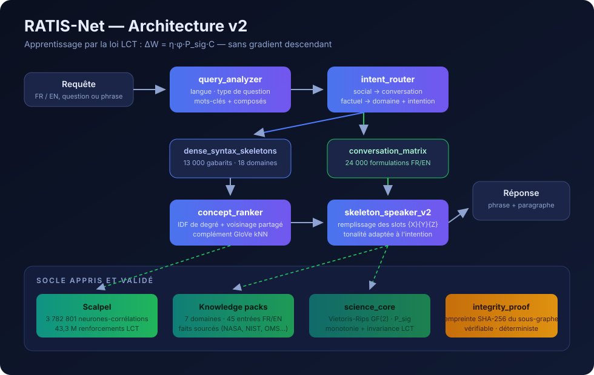
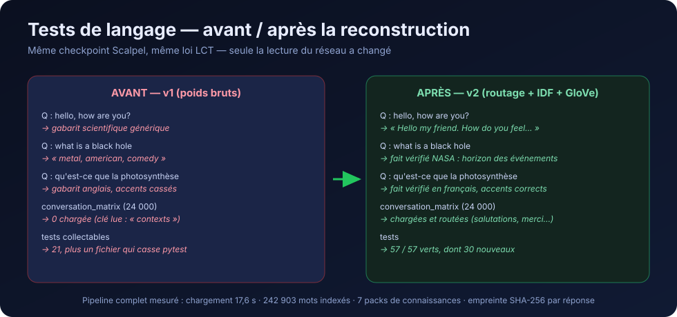
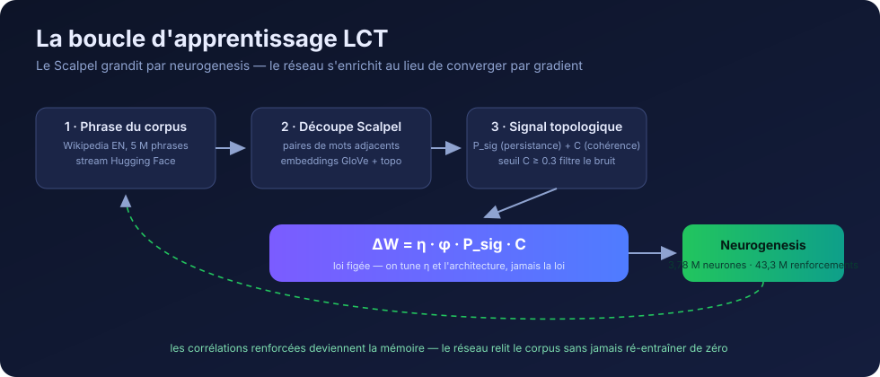

# RATIS-Net

**Un réseau neuronal entraîné par la Loi de Cohérence Topologique (LCT) — sans gradient descendant.**

[](pyproject.toml)
[](#tests)
[](LICENSE)
[](https://orcid.org/0009-0000-4092-5313)

> Au lieu de minimiser une loss par backpropagation, RATIS-Net maximise la
> persistance topologique de son graphe de corrélations : il apprend en
> devenant topologiquement robuste. La loi est figée :
> **R = P_sig** et **ΔW = η·φ·P_sig·C**.



---

## Installation

```bash
git clone https://github.com/evinajonathan13-max/Ratiss-experimental-IA-.git
cd Ratiss-experimental-IA-
pip install .
git lfs install && git lfs pull          # checkpoint Scalpel (294 MB)
mkdir -p data/glove && curl -L -o data/glove/glove.6B.zip \
    https://nlp.stanford.edu/data/glove.6B.zip
python3 -c "import zipfile; zipfile.ZipFile('data/glove/glove.6B.zip').extract('glove.6B.50d.txt','data/glove/')"
```

Dépendances minimales : `numpy`. Extras : `pip install .[full]` (scipy, gudhi),
`.[train]` (datasets), `.[dev]` (pytest).

## Démarrage en 5 minutes

```python
from ratis_net import RatisNet

net = RatisNet()
net.load_scalpel("artifacts/scalpel_wikipedia.pkl")   # 3,78 M neurones
net.load_grammar()                                     # 13 000 + 24 000 gabarits
net.load_knowledge_packs()                             # 7 domaines, faits sourcés
net.build_index()                                      # ~9 s, 242 903 mots

net.respond("hello, how are you?")
# → "Hello my friend. How do you feel about this today, ..."

r = net.respond_with_science("what is a black hole")
r["sentence"]
# → "A black hole is a region of spacetime whose gravity is so strong that
#    nothing, not even light, can escape once past the event horizon. ..."

net.respond("qu'est-ce que la photosynthèse")
# → fait vérifié en français (base de connaissances bilingue)
```

## Ligne de commande

```bash
ratisnet converse "hello, how are you?"
ratisnet ask "what is a black hole"
ratisnet ask "qu'est-ce qu'un trou noir" --json
ratisnet concepts --word quantum --n 10
ratisnet chain --from quantum --to gravity
ratisnet prove --concepts quantum,mechanics
ratisnet stats
```

## Serveur HTTP (API)

```bash
ratisnet-serve --port 8000
```

| Endpoint | Corps | Réponse |
|---|---|---|
| `GET /health` | — | statut + statistiques du réseau |
| `POST /respond` | `{"q": "..."}` | phrase + concepts + squelette |
| `POST /science` | `{"q": "..."}` | réponse enrichie : faits vérifiés + LCT |
| `POST /concepts` | `{"word": "quantum"}` | concepts classés par pertinence |
| `POST /chain` | `{"from": "a", "to": "b"}` | chaînes d'association tracées |
| `POST /prove` | `{"concepts": [...]}` | empreinte SHA-256 du sous-graphe |

---

## Ce que fait le pipeline v2



1. **query_analyzer** — détecte la langue (FR/EN), classe le type de question
   (salutation, définition, explication, identité…), extrait mots-clés et
   composés (« black hole »).
2. **intent_router** — social → matrice conversationnelle (24 000 formulations) ;
   factuel → grammaire dense (18 domaines, 12 intentions).
3. **concept_ranker** — classe les concepts par IDF de degré, voisinage
   partagé entre mots-clés, et complément GloVe kNN. Fini les co-occurrences
   ubiquitaires en tête de liste.
4. **skeleton_speaker_v2** — remplit les gabarits grammaticaux avec les
   concepts classés, tonalité adaptée à l'intention.
5. **knowledge packs** — faits vérifiés FR/EN sourcés (NASA, NIST, IUPAC,
   OMS, NIH) injectés en tête de réponse quand le concept est couvert.
6. **integrity_proof** — chaque réponse peut emporter l'empreinte SHA-256
   du sous-graphe de corrélations qui l'a produite (vérifiable, déterministe).



---

## API Python complète

| Méthode | Description |
|---|---|
| `respond(q)` | Phrase de réponse (langue auto-détectée) |
| `respond_with_science(q)` | Phrase + faits vérifiés + mesure LCT + web si inconnu |
| `paragraph(theme, n_sentences=5)` | Paragraphe sur un thème |
| `concepts(word, n=10)` | Concepts classés par pertinence |
| `chain(a, b, max_hops=3)` | Chaînes d'association (corrélation, pas causalité) |
| `prove(concepts)` | Empreinte SHA-256 du sous-graphe |
| `verify_proof(proof)` | Vérifie qu'une empreinte se reproduit |
| `lookup_knowledge(concept)` | Faits validés dans les 7 packs |
| `search(query)` | Recherche web (DuckDuckGo sans clé) |
| `stats()` | Statistiques du réseau |

## Tests

```bash
python -m pytest tests/ -q     # 57/57
```

- `test_scalpel.py` — neurogenesis et renforcement LCT (8)
- `test_ratiss_synchrotron.py` — reconstruction topologique (9)
- `test_lct_modules.py` — qubit topologique, transformeur LCT (4)
- `test_lct_new_systems.py` — loi LCT sur réseaux sociaux et cristaux (4)
- `test_language_pipeline.py` — analyzer, routeur, ranker, chaînes, preuves (19)
- `test_language_quality.py` — **test de langage bout en bout sur le vrai
  checkpoint** : conversation, science, biologie, FR/EN (13)

## Limites honnêtes

1. RATIS-Net n'est pas une base de connaissances : il reconstruit à partir de
   fragments appris ; les faits exacts viennent des knowledge packs.
2. Grammaire à gabarits : correcte, pas aussi fluide qu'un Transformer.
3. Le Scalpel capture des paires adjacentes après filtrage cos(GloVe) ≥ 0.3 ;
   les composés non adjacents (« black hole ») sont reconstruits à l'analyse.
4. Couverture = corpus Wikipedia EN + packs ; le web compense l'inconnu.
5. Les chaînes d'association sont des corrélations tracées, pas des inférences.
6. Le checkpoint Scalpel est anglophone ; le français passe par les gabarits
   et les packs (multilingue complet = piste ouverte).
7. La preuve d'intégrité SHA-256 n'est pas un ZK-STARK : elle engage sur les
   données, elle ne prouve pas un calcul privé.
8. Le biais du corpus persiste dans les concepts bruts (Wikipedia : « black »
   voisine « metal ») — le ranker l'atténue, ne l'efface pas.

## Propriété intellectuelle

© 2025-2026 **Jonathan Evina & JOHNKING0** — tous droits réservés.
Licence propriétaire : voir [LICENSE](LICENSE). Aucune licence MIT ou Apache
ne s'applique. ORCID [0009-0000-4092-5313](https://orcid.org/0009-0000-4092-5313) ·
DOI [10.17605/OSF.IO/6JZMB](https://doi.org/10.17605/OSF.IO/6JZMB).
