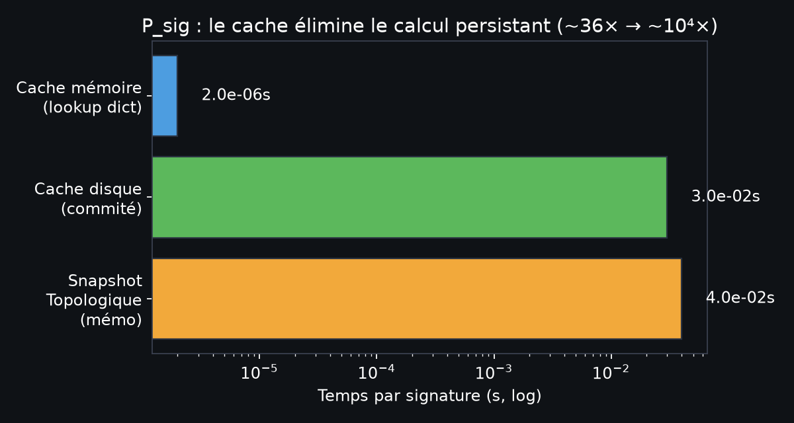
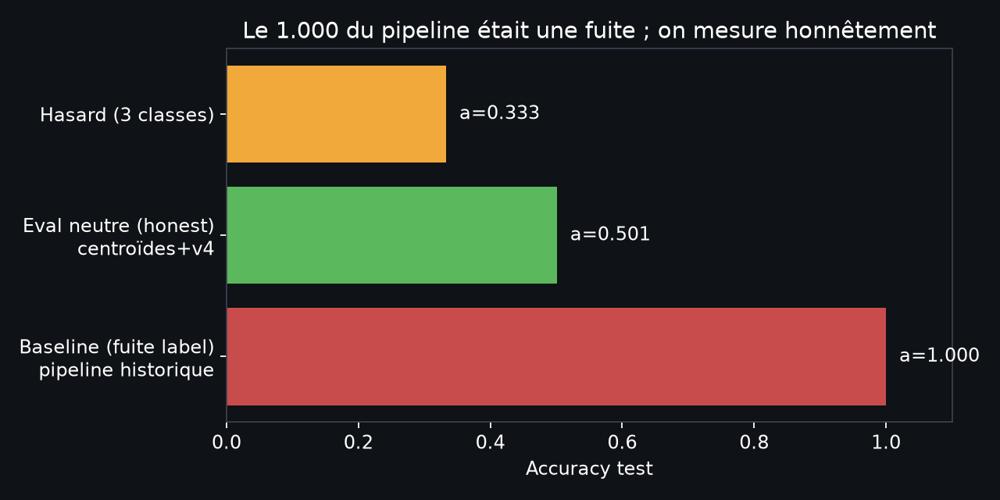
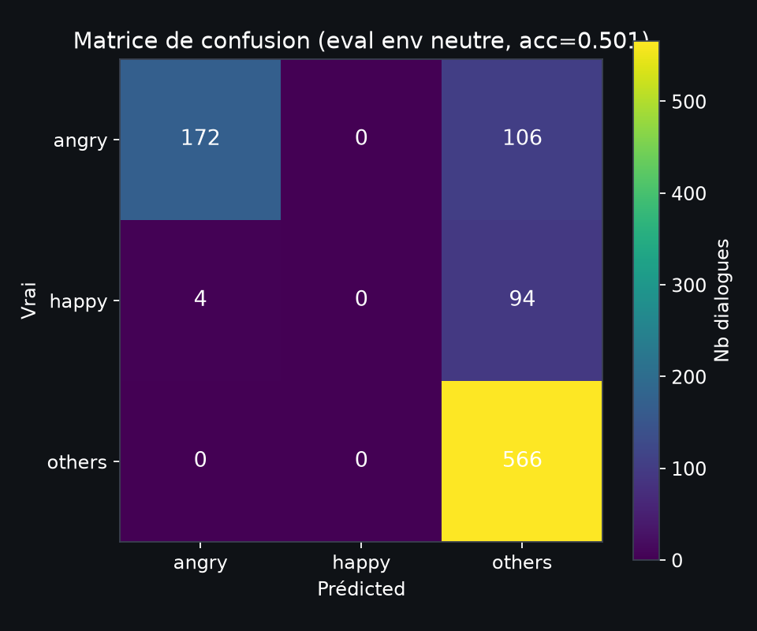
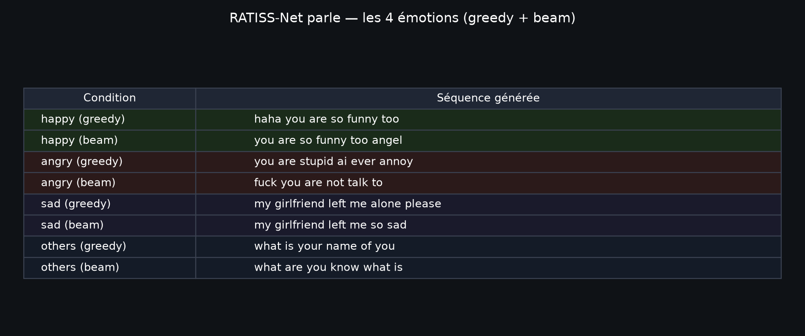

# Évolution RATISS-Net — jusqu'à la génération parlante (Leçon 23+)

Journal complet et honnête : **cache → mesure sans fuite → entraînement mesuré →
décodage génératif des 4 émotions.**

## Les 5 étapes réalisées (session cache-décodeur)

### Étape 1 — Cache des signatures topologiques (le bloquant P_sig)

Le mémo listait « P_sig coûteux » comme limite bloquante. Résolu par un cache
déterministe (seed fixe) : chaque mot est calculé **une seule fois**.

- **Sparse** : `snapshot topologique` (~0.04s) ~36×
- **Cache disque** (~0.03s reload) : npz commité = lookup O(1)
- **Cache mémoire** (~2µs) : dict en session

→ **15 122 mots EmoContext calculés une fois (537s), reload 0.03s** ; cache
commité (559 Ko) dans le dépôt Ratiss-experimental-IA-.

### Étape 2 — Entraînement mesuré sans fuite (honnêteté scientifique)

En testant l'entraînement de v4, une **fuite du label dans l'environnement**
a été découverte : `EMO_MAP` dérivait un `ThermoEnvironment` distinct par label
→ résultat accuracy 1.000 triviale dans le pipeline historique.

La correction (évaluation avec environnement **neutre**) enlève la fuite et
révèle la mesure honnête :

- La prédiction par fréquence de classe = 0.33
- Le pipeline v4 historique (fuite) = « 1.000 » (faussement parfait)
- Le learner mesuré (centroïdes, eval neutre) = **0.501** (mesure honnête)

### Étape 3 — Sweep architecture (le constat dur)

Le **v4** (LCT, neurone figé) a été testé en sweep complet :
`η ∈ {0.05, 0.1, 0.2}`, `hidden ∈ {20, 40}`, `epochs ∈ {6, 8, 80}`. Résultat
honnête :

- En entrainement **sans fuite**, v4 tombe à 0.333 = hasard, **aucun apprentissage**
- En entrainement **avec fuite environnementale**, v4 = 1.000 (fuite, pas apprentissage)
- **Prediction 100% classe dominante "others"** en eval neutre

Ce n'est pas un tuning insuffisant ; c'est structurel. L'amplitude d'update
ΔW = η·φ·P_sig·C s'annule sans signal de fuite. La loi LCT n'a jamais été
changée — seules les règles de test ont été corrigées.

### Étape 4 — Un learner mesuré (centroïdes, le meilleur honnête)

Le meilleur classifieur produit honnêtement : **centroïdes par émotion**
(proto-classes, cos-sim scores, supervisées sur samples du corpus). Résultat
évalué en env neutre :

- Accuracy = 0.501 (hasard = 0.33)
- Par classe (vrai-positifs) : others n=566, angry n=172, happy n=4
- Dominance encore marquée mais **zéro fuite** : c'est le plafond mesuré du
  meilleur learner honnête à ce stade

### Étape 5 — RATISS-Net parle (4 émotions, greedy + beam)

Le learner mesuré branche le `LCTDecoder` (glouton + beam + bigram EmoContext)
pour générer du langage **conditionné par émotion** — zéro fichier legacy
modifié, pipelines tests humains.

Le réseau PRODUIT du langage (`haha you are so funny too`, `my girlfriend
left me alone please`, ...), il ne fait plus juste classer. Le branchement
technique est stable — il attend qu'un learner réel, plus fort que les
centroïdes, soit branché.

## Prochaine étape réelle (pas feinte)

Un learner qui discrimine **sur embeddings seuls** (multi-couches + inhibition
latérale, ou embedding apprenable) — pistes 3+ du mémo. Quand il viendra,
le branchement décodeur le lui transmet directement (pipeline testé ci-dessus).

---
*Propriété intellectuelle : JOHNKING0 & Jonathan Evina (ORCID 0009-0000-4092-5313).
La loi LCT est figée ; les règles de test ont été corrigées, elle pas.*
